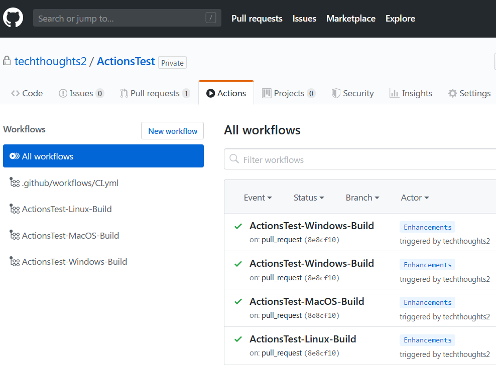

# Catesta - GitHub Actions Integration

## Synopsis

Scaffolds a new PowerShell module project intended for CI/CD workflow using [GitHub Actions](https://help.github.com/actions).

## Getting Started

*Note: Before getting started you should have a basic idea of what you expect your module to support. If your module is cross-platform, or you want to test different versions of PowerShell you should run multiple build types.*

| Windows PowerShell  | Windows pwsh | Linux | MacOS |
| ------------- | ------------- | ------------- | ------------- |

1. You will [need a GitHub account](https://github.com/join).
1. Create a new repository and clone to your local dev device
1. Create your project using Catesta

    ```powershell
    New-PowerShellProject -CICDChoice 'GitHubActions' -DestinationPath C:\path\GitHubActions
    ```

    1. The Plaster logo will be displayed and you will see your first prompt
    1. **Enter the name of the module:** *Name of your module*
    1. **Enter a description for the module:** *Description of what your module does*
    1. **Enter the version number of the module (0.0.1)**: *Starting version #*
    1. **Enter your full name**: *Module author name*
    1. **Would you like to generate a Changelog file?**
    1. **Select a License for your module. (Help deciding: [https://choosealicense.com/](https://choosealicense.com/))**
    1. **Would you like to generate a Code of Conduct file?**
    1. **Would you like to generate a Contributing guidelines file?**
    1. **Would you like to specify a coding style for the project? [S] Stroustrup  [O] OTBS  [A] Allman  [N] None  [?] Help (default is "S"):** *The preferred coding style for the project*
    1. **Would you like to use platyPS to generate help documentation files for your project?** *Creates Markdown & external help for your module*
    1. **Select desired pipeline job configurations. (If your module is cross-platform you should select multiple)**
        * [W] Windows - PowerShell
        * [C] Core (Windows)- pwsh
        * [L] Linux
        * [M] MacOS
1. Write a kick-ass module (the hardest part)
    * All build testing can be done locally by navigating to src and running ```Invoke-Build```
    * If using VSCode as your primary editor you can use tasks to perform various local actions
      * Examples:
        * ```Press Ctrl+P, then type 'task .'``` - Runs complete build (all tasks)
        * ```Press Ctrl+P, then type 'task Test'``` - Invokes all Pester Unit Tests
        * ```Press Ctrl+P, then type 'task Analyze'``` - Invokes Script Analyzer checks
        * ```Press Ctrl+P, then type 'task DevCC'``` - Generates generate xml file to graphically display code coverage in VSCode using [Coverage Gutters](https://marketplace.visualstudio.com/items?itemName=ryanluker.vscode-coverage-gutters)
1. *The comment based help in your functions will be used to generate/update markdown docs for your module in the docs folder.*
1. Upload to your desired repository which now has a triggered/monitored build action.
1. Evaluate results of your build and display your GitHub Actions badge proudly!



## Notes

Additional Reading:

* [Automating your workflow with GitHub Actions](https://help.github.com/en/actions/automating-your-workflow-with-github-actions)
* [Virtual environments for GitHub-hosted runners](https://help.github.com/en/actions/automating-your-workflow-with-github-actions/virtual-environments-for-github-hosted-runners)
* [Software installed on GitHub-hosted runners](https://help.github.com/en/actions/automating-your-workflow-with-github-actions/software-installed-on-github-hosted-runners)
* [Using a specific shell](https://help.github.com/en/actions/automating-your-workflow-with-github-actions/workflow-syntax-for-github-actions#using-a-specific-shell)
* [Workflow syntax for GitHub Actions](https://help.github.com/en/actions/automating-your-workflow-with-github-actions/workflow-syntax-for-github-actions)
* [Where does the upload go?](https://docs.github.com/en/actions/automating-builds-and-tests/building-and-testing-powershell)
* [Building and testing PowerShell](https://github.com/actions/upload-artifact#where-does-the-upload-go)

## Diagrams

### GitHub Actions


## Example Projects

* [Catesta](https://github.com/techthoughts2/Catesta)
* [pwshPlaces](https://github.com/techthoughts2/pwshPlaces)
* [ApertaCookie](https://github.com/techthoughts2/ApertaCookie)
