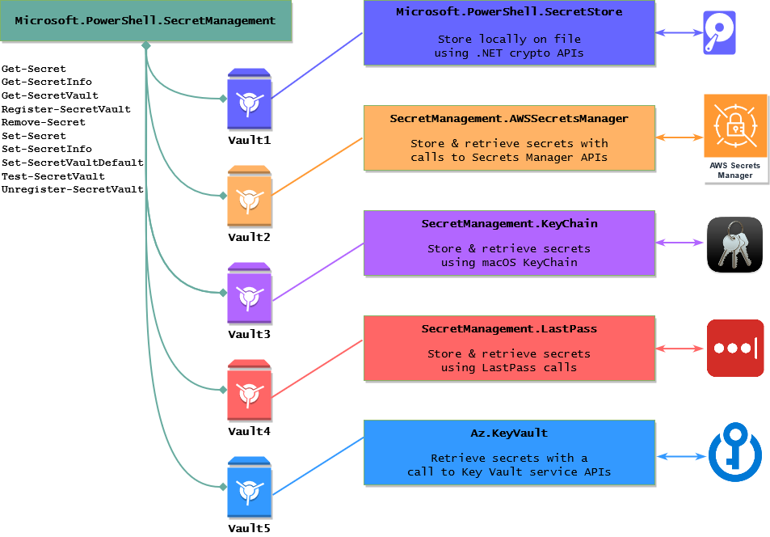

# Catesta - Vault Extension Module

## Synopsis

Scaffolds a [PowerShell SecretManagement vault module project](https://github.com/PowerShell/SecretManagement) for use with desired CICD platform for easy cross platform PowerShell development.

## Getting Started

-------------------

*Note: It is important to have a clear understanding of what your module should support before you begin your project with Catesta. IIf your module is designed to be cross-platform or you plan to test different versions of PowerShell, it is recommended to run multiple build types to cover different scenarios. This will help you validate that your module works as expected on different platforms and environments.*


-------------------

1. Create your vault extension project using Catesta. *([Catesta Basics](../Catesta-Basics.md))*
    * *NOTE: As a community best practice SecretManagement projects have SecretManagement.VaultName added to a project name. Catesta will automatically accomplish this for you. Just select a name for your vault project and let Catesta do the rest*
1. Write the logic for your vault extension module (the hardest part)
    * All build testing can be done locally by navigating to `src` and running `Invoke-Build`
        * By default, this runs all tasks in the build file.
            * If you want to run a specific task from the build file you can provide the task name. For example, to just execute Pester tests for your project: `Invoke-Build -Task Test`
    * If using VSCode as your primary editor you can use VSCode tasks to perform various local actions
        * Open the VSCode Command palette
            * Shift+Command+P (Mac) / Ctrl+Shift+P (Windows/Linux) or F1
        * Type `Tasks: Run Task`
        * Select the task to run
            * Examples:
                * `task .` - Runs complete build (all tasks)
                * `task Test` - Invokes all Pester Unit Tests
                * `task Analyze` - Invokes Script Analyzer checks
                * `task DevCC` - Generates generate xml file to graphically display code coverage in VSCode using [Coverage Gutters](https://marketplace.visualstudio.com/items?itemName=ryanluker.vscode-coverage-gutters)

## Notes

The structure and layout of a SecretManagement Vault extension module differs quite a bit from a standard PowerShell module:

```powershell
./SecretManagement.TestVault
./SecretManagement.TestVault/SecretManagement.TestVault.psd1
./SecretManagement.TestVault/SecretManagement.TestVault.psm1
./SecretManagement.TestVault/TestStoreImplementation.dll
./SecretManagement.TestVault/SecretManagement.TestVault.Extension
./SecretManagement.TestVault/SecretManagement.TestVault.Extension/SecretManagement.TestVault.Extension.psd1
./SecretManagement.TestVault/SecretManagement.TestVault.Extension/SecretManagement.TestVault.Extension.psm1
```

*NOTE: Because of the nested nature of the vault extension, and how user facing functions are surfaced up, Catesta does not support automated help generation via platyPS for Vault extension projects.*

## PowerShell SecretManagement Diagram



## Additional Reading

* [Announcing SecretManagement 1.1 GA](https://devblogs.microsoft.com/powershell/announcing-secretmanagement-1-1-ga/)
* [SecretManagement and SecretStore are Generally Available](https://devblogs.microsoft.com/powershell/secretmanagement-and-secretstore-are-generally-available/)
* [SecretManagement Module v1.1.0 preview update](https://devblogs.microsoft.com/powershell/secretmanagement-module-v1-1-0-preview-update/)
* [PowerShell SecretManagement Module Design](https://github.com/PowerShell/SecretManagement/blob/main/Docs/DesignDoc.md)
* [PowerShell Secrets Management – Part 1: Introduction](https://www.powershell.co.at/powershell-secrets-management-part-1-introduction/)
* [PowerShell Secrets Management – Part 2: Installation and first steps](https://www.powershell.co.at/powershell-secrets-management-part-2-installation-and-first-steps/)
* [SecretManagement and SecretStore Release Candidate 2](https://devblogs.microsoft.com/powershell/secretmanagement-and-secretstore-release-candidate-2/)
    * [SecretManagement Module Preview Design Changes](https://devblogs.microsoft.com/powershell/secretmanagement-module-preview-design-changes/)
    * [SecretManagement and SecretStore Updates](https://devblogs.microsoft.com/powershell/secretmanagement-and-secretstore-updates-2/)
* [Secrets Management Module Vault Extensions](https://devblogs.microsoft.com/powershell/secrets-management-module-vault-extensions/)

## SecretManagement and SecretStore Repos

* [SecretManagement](https://github.com/PowerShell/SecretManagement)
* [SecretStore](https://github.com/PowerShell/SecretStore)
* [Azure Vault](https://github.com/PowerShell/SecretManagement/blob/main/ExtensionModules/AKVaultScript/AKVaultScript.Extension/AKVaultScript.Extension.psm1)

## Vault Extension Examples

* [SecretManagement.1Password](https://github.com/cdhunt/SecretManagement.1Password)
* [SecretManagement.BitWarden](https://github.com/Gaspack/SecretManagement.BitWarden)
* [SecretManagement.Chromium](https://github.com/JustinGrote/SecretManagement.Chromium)
* [SecretManagement.CyberArk](https://github.com/aaearon/SecretManagement.CyberArk)
* [SecretManagement.Hashicorp.Vault.KV](https://github.com/joshcorr/SecretManagement.Hashicorp.Vault.KV)
* [SecretManagement.KeePass](https://github.com/JustinGrote/SecretManagement.KeePass)
* [KeybaseSecretManagementExtension](https://github.com/tiksn/KeybaseSecretManagementExtension)
* [SecretManagement.KeyChain](https://github.com/SteveL-MSFT/SecretManagement.KeyChain)
* [SecretManagement.LastPass](https://github.com/TylerLeonhardt/SecretManagement.LastPass)
