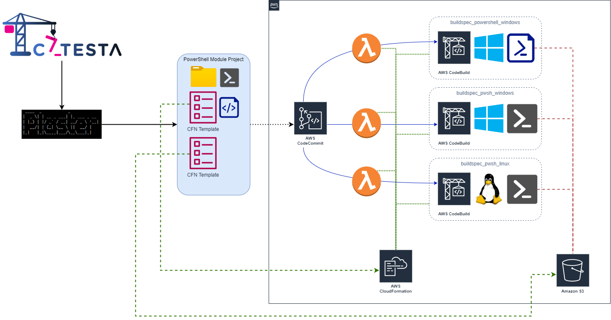

# Catesta - AWS CodeBuild Integration

## Synopsis

Scaffolds a new PowerShell module project intended for CI/CD workflow using [AWS CodeBuild](https://aws.amazon.com/codebuild/).

## Getting Started

-------------------

*Note: It is important to have a clear understanding of what your module should support before you begin your project with Catesta. IIf your module is designed to be cross-platform or you plan to test different versions of PowerShell, it is recommended to run multiple build types to cover different scenarios. This will help you validate that your module works as expected on different platforms and environments.*

-------------------

1. You will [need an AWS Account](https://aws.amazon.com/premiumsupport/knowledge-center/create-and-activate-aws-account/).
1. Create your project using Catesta and select `[C] AWS CodeBuild` at the CICD prompt. *([Catesta Basics](../Catesta-Basics.md))*
    * *Note: You will see the following prompt unique to the AWS CodeBuild selection:*
        * **Enter S3 bucket name to download needed PS modules from S3 location. Leave blank to DL modules from PSGallery.** Your CodeBuild instance will need various modules to successfully build your PowerShell module project. By default, it does not contain them. Leaving this blank will default to having the CodeBuild instance download and install the needed modules from the PSGallery during each build. You can improve build times and performance by instead loading the required modules into an S3 bucket. If you choose to do so, you can specify the S3 bucket here. Don't forget to give your CodeBuild project permission to that S3 bucket.
1. Create your CodeBuild project in your AWS account. You can do this manually, or use the generated CloudFormation template (recommended).
    * **GitHub**
        * The generated CFN template will guide you through the process. This CFN will be dynamically altered based on your buildspec choice specified during the plaster process. If you choose all three, the CFN will deploy all required resources to support all three build types.
        * CodeBuild projects currently use OATH to authenticate with GitHub. See the notes section below for configuring this.
        * The GitHub process is not currently configured to generate artifacts. You are welcome to make adjustments to include them.
        * *Don't forget to copy your badge URL to display on your project*
    * **CodeCommit**
        * The CodeCommit does include artifacts. Artifacts built from your main branch will be stored in a primary s3 bucket. All other branches will have artifacts stored in a development bucket.
        * The generated CFN template will guide you through the process. This CFN is different than the GitHub one in that you only need to deploy it once. This CFN will be dynamically altered based on your buildspec choice specified during the plaster process. If you choose all three, the CFN will deploy all required resources to support all three build types.
1. Write the logic for your module (the hardest part)
    * All build testing can be done locally by navigating to `src` and running `Invoke-Build`
        * By default, this runs all tasks in the build file.
            * If you want to run a specific task from the build file you can provide the task name. For example, to just execute Pester tests for your project: `Invoke-Build -Task Test`
    * If using VSCode as your primary editor you can use VSCode tasks to perform various local actions
        * Open the VSCode Command palette
            * Shift+Command+P (Mac) / Ctrl+Shift+P (Windows/Linux) or F1
        * Type `Tasks: Run Task`
        * Select the task to run
            * Examples:
                * `task .` - Runs complete build (all tasks)
                * `task Test` - Invokes all Pester Unit Tests
                * `task Analyze` - Invokes Script Analyzer checks
                * `task DevCC` - Generates generate xml file to graphically display code coverage in VSCode using [Coverage Gutters](https://marketplace.visualstudio.com/items?itemName=ryanluker.vscode-coverage-gutters)
1. *The comment based help in your functions will be used to generate/update markdown docs for your module in the docs folder.*
1. Add any module dependencies to your CI/CD bootstrap file: `install_modules.ps1`
1. Upload to your desired repository which now has a triggered/monitored build action.
1. Evaluate results of your build and display your AWS CodeBuild badge proudly!

### Manual CFN upload example

The following shows the GitHub CFN example:

### Final CFN Deployment Results example

## Notes

This template currently supports two repository sources that the user can specify when invoking the template:

* [GitHub](https://github.com/)
* [AWS CodeCommit](https://aws.amazon.com/codecommit/)

If you elect to host your code in GitHub you will need to manually associate your AWS account with your GitHub account. This is a one time manual action.

[Configure GitHub Authentication](https://docs.aws.amazon.com/codepipeline/latest/userguide/GitHub-authentication.html)

> For source code in a GitHub repository, the HTTPS clone URL to the repository that contains the source and the build spec. You must connect your AWS account to your GitHub account. Use the AWS CodeBuild console to start creating a build project. When you use the console to connect (or reconnect) with GitHub, on the GitHub Authorize application page, for Organization access, choose Request access next to each repository you want to allow AWS CodeBuild to have access to, and then choose Authorize application. (After you have connected to your GitHub account, you do not need to finish creating the build project. You can leave the AWS CodeBuild console.) To instruct AWS CodeBuild to use this connection, in the source object, set the auth object's type value to OAUTH.

You may wish to use different CodeBuild projects to monitor different branches of your repository. If you are using GitHub this can be done with a WebhookFilter:

[AWS CodeBuild Project WebhookFilter](https://docs.aws.amazon.com/AWSCloudFormation/latest/UserGuide/aws-properties-codebuild-project-webhookfilter.html)

## Diagrams

### AWS CodeBuild Integration with GitHub

### AWS CodeBuild Integration with CodeCommit

## Example Projects

A few PowerShell module projects you can reference that are using AWS CodeBuild:

* [PoshGram](https://github.com/techthoughts2/PoshGram)
* [Diag-V](https://github.com/techthoughts2/Diag-V)
* [FastPing](https://github.com/austoonz/FastPing)
