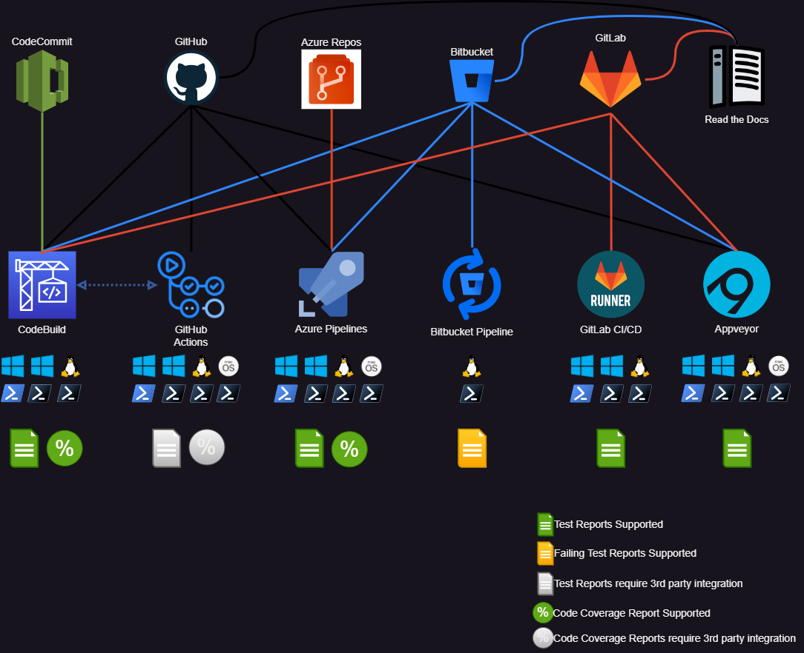

# Catesta

[](https://github.com/PowerShell/PowerShell) [![PowerShell Gallery][psgallery-img]][psgallery-site]  [![License][license-badge]](LICENSE) [](https://rtdtest222222.readthedocs.io/en/latest/?badge=latest)

[psgallery-img]:   https://img.shields.io/powershellgallery/dt/Catesta?label=Powershell%20Gallery&logo=powershell
[psgallery-site]:  https://www.powershellgallery.com/packages/Catesta
[license-badge]:   https://img.shields.io/github/license/techthoughts2/Catesta

## What is Catesta?

Catesta is a PowerShell module and vault project generator. It uses templates to rapidly scaffold test and build integration for a variety of CI/CD platforms.

<p align="left">
    
</p>

## Why Catesta?

Catesta streamlines the process of structuring your PowerShell module or Vault extension project, allowing you to focus on creating a top-quality project without getting bogged down in formatting, testing, and build automation. With Catesta, you can generate all the necessary build files, configurations, and integrations for your project with just a single command.

## Getting Started

### Installation

```powershell
# Install Catesta from the PowerShell Gallery
Install-Module -Name Catesta -Repository PSGallery -Scope CurrentUser
```

### Quick start

#### PowerShell Module

```powershell
# Scaffolds a PowerShell module project with customizable CI/CD integration options
New-ModuleProject -DestinationPath $outPutPath
```

#### SecretManagement Vault Extension Project

```powershell
# Scaffolds a PowerShell SecretManagement vault project with customizable CI/CD integration options
New-VaultProject -DestinationPath $outPutPath
```

## How Catesta Works

Catesta uses customized Plaster templates to enable you to quickly scaffold a [PowerShell module](https://docs.microsoft.com/powershell/scripting/developer/module/how-to-write-a-powershell-script-module?view=powershell-7) or [Vault extension](https://github.com/PowerShell/SecretManagement) project with proper formatting, test + build automation, CI/CD integration, with just one line of code.

* Catesta scaffolds an empty Module/Vault project that adheres to PowerShell community guidelines.
* It generates a few [Pester](https://github.com/pester/Pester) tests to get you started.
* It makes a [build file](https://github.com/nightroman/Invoke-Build) that analyzes your code for best practices and styling, runs Pester tests, creates PowerShell help, and combines your functions together to build your project for publication.
* It will create resources you need to trigger CI/CD builds for your project.
* When you commit your code to your chosen repository, the build(s) will run, and you can view the results.


*Note: The links above only show natively supported integrations between repositories and CI/CD platforms. It is possible to establish a connection to remote Git repositories for source control, and to replicate repositories from source to another location, which can expand the range of integration scenarios.*

## Features

Catesta can build two types of projects:

1. [PowerShell module](https://docs.microsoft.com/powershell/scripting/developer/module/writing-a-windows-powershell-module?view=powershell-7) layout following PowerShell community practices
1. [SecretManagement Vault extension module](https://github.com/PowerShell/SecretManagement) layout following PowerShell community practices

Selections

* *[Selection]* CI/CD build integration:
    * [GitHub Actions](catesta_cicd/Catesta-GHActions.md)
    * [AWS CodeBuild](catesta_cicd/Catesta-AWS.md)
    * [GitHub Actions on AWS CodeBuild](catesta_cicd/Catesta-GHActionsAWSCodeBuild.md)
    * [AppVeyor](catesta_cicd/Catesta-AppVeyor.md)
    * [GitLab CI/CD](catesta_cicd/Catesta-GitLab.md)
    * [Bitbucket Pipelines](catesta_cicd/Catesta-Bitbucket.md)
    * [Azure Pipelines](catesta_cicd/Catesta-Azure.md)
* *[Selection]* Build types for easy cross-platform testing
    * Windows PowerShell
    * Windows pwsh
    * Linux
    * MacOS
* [InvokeBuild](https://github.com/nightroman/Invoke-Build) tasks for validation / analysis / test / build automation
    * [PSScriptAnalyzer](https://github.com/PowerShell/PSScriptAnalyzer) code checks
        * *[Optional]* Code Style Enforcement (Stroustrup, OTBS, Allman)
    * [Pester](https://github.com/pester/Pester) Tests
        * Will run Unit / Integration Tests if available
        * Generates Code Coverage Report
        * [Coverage Gutters](https://marketplace.visualstudio.com/items?itemName=ryanluker.vscode-coverage-gutters) support
    * *[Optional]* Create Help using [platyPS](https://github.com/PowerShell/platyPS)
        * Markdown-based help
        * External XML help file generation
    * Build and artifact creation
* Helpful VSCode editor files
* *[Optional]* Helpful repository files
    * .gitignore
    * Project LICENSE (MIT / APACHE / GNU / ISC)
    * [Changelog](https://keepachangelog.com/en/1.0.0/)
    * Community files:
        * Code of Conduct
        * Contributing guidelines
        * Templates *(if supported)*
            * Issue Bug Report
            * Issue Feature Request
            * Pull Request
    * [Read the Docs](https://readthedocs.org/) integration
* *[Selection]* [Pester](https://github.com/pester/Pester) version selection. Choose between Pester version 5 or Pester version 4 for testing your project.
